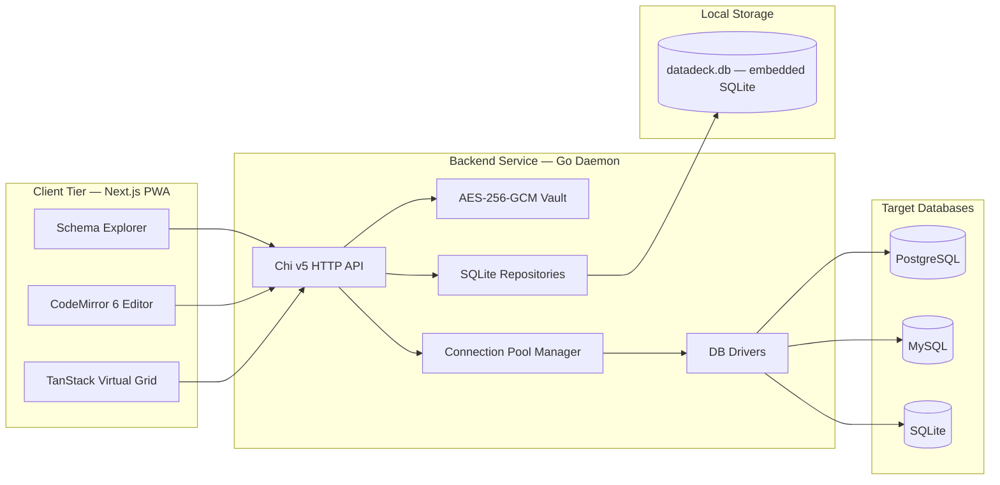
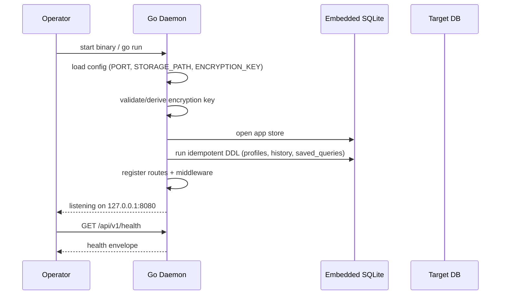
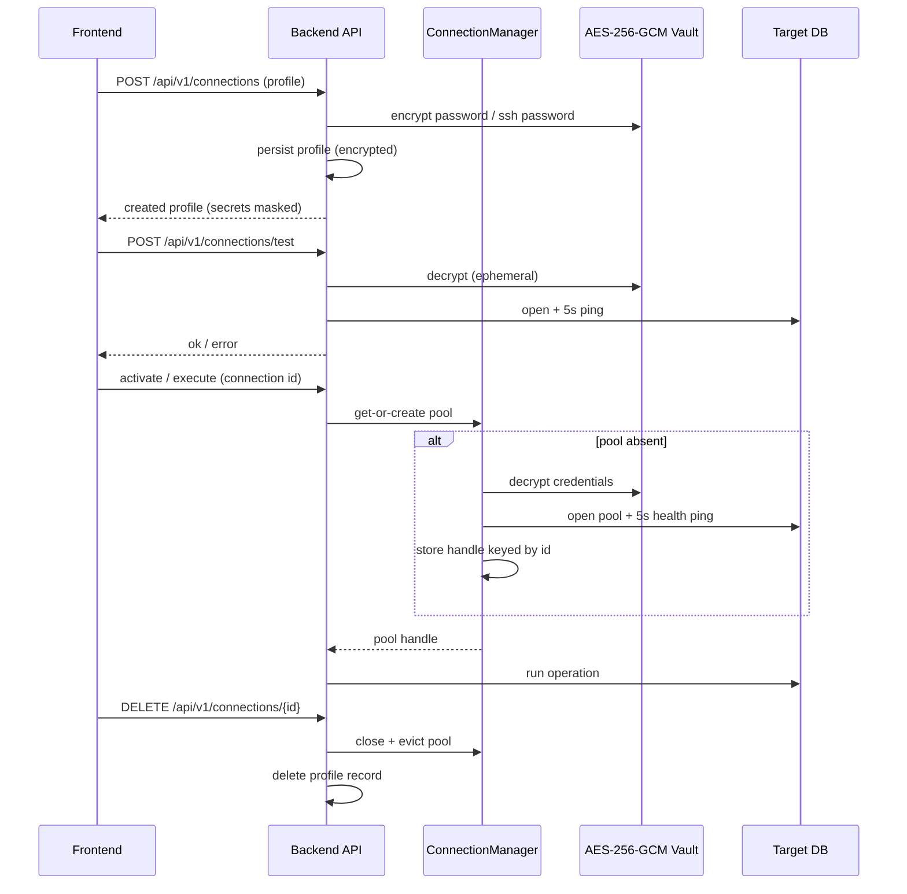
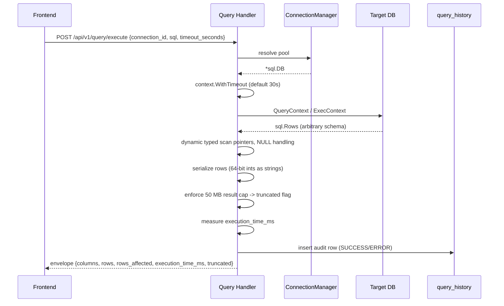
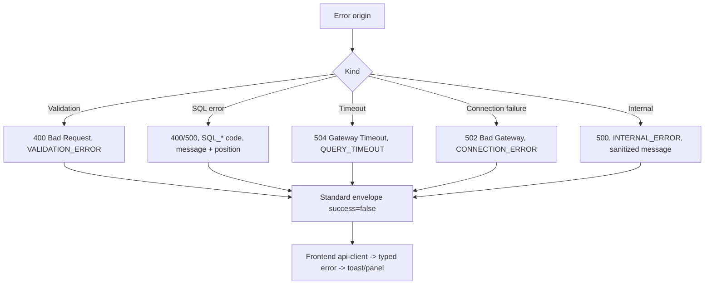
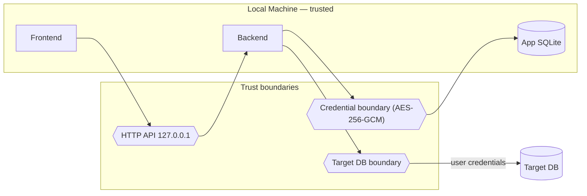

# DataDeck — Architecture

> Technical source of truth derived from `PRD.md`. If this document and the PRD
> disagree, the PRD wins. Unknowns are marked **Needs Validation**.

---

## 1. System Overview

DataDeck is a local-first Web/PWA database GUI composed of two tiers plus a set
of external systems:

| Tier | Technology | Responsibility |
|---|---|---|
| Client | Next.js App Router + React 19 + TypeScript | UI, editor, virtualized grid, local view state |
| Backend | Go 1.23+ daemon, Chi v5 HTTP mux | HTTP API, connection pooling, introspection, query execution, encryption |
| App Storage | Embedded SQLite (`modernc.org/sqlite`) | Connection profiles, query history, saved queries |
| Target Databases | PostgreSQL (`jackc/pgx/v5`), MySQL (`go-sql-driver/mysql`), SQLite (`modernc.org/sqlite`) | Systems the user connects to and queries |

---

## 2. Main Architectural Goals

1. **Ultra-light footprint.** Backend idle RAM target `< 25 MB`; no JVM, no CGO
   (`modernc.org/sqlite`), no runtime container requirement for local use.
2. **Local-first and private.** Everything runs on the user's machine by default;
   the daemon binds to `127.0.0.1`. Credentials never leave the machine.
3. **Zero-config startup.** The embedded SQLite app store is created automatically.
4. **High-throughput rendering.** The grid virtualizes rows/columns and renders
   100,000+ records at 60 FPS; result payloads are bounded (50 MB) to protect
   both client and server memory.
5. **Single-binary capable distribution.** The frontend can be statically exported
   and embedded into the Go binary via `embed.FS`.
6. **Clear seams for autonomous agents.** Each layer has explicit responsibilities
   and contracts so work can be parallelized without cross-layer coupling.

---

## 3. Frontend Responsibilities

Owned by `frontend/`.

- **Rendering & interaction only.** No direct database access, no credential
  decryption, no persistence of connection profiles.
- **SQL editing.** CodeMirror 6 with SQL dialect parsing, keyword autocomplete,
  and statement/block detection.
- **Keybindings.** `Cmd+Enter` / `Ctrl+Enter` run selected or current statement;
  `Cmd+S` saves a snippet.
- **Virtualized grid.** TanStack Table v8 + TanStack Virtual v3; 100k+ rows,
  column resize/sort, copy cell, export CSV/JSON.
- **Schema explorer.** Renders hierarchy `Profile → Database → Schema → Table →
  Column / Index / Foreign Key` and context-menu actions.
- **API access through a single client.** All HTTP goes through
  `frontend/src/lib/api-client.ts`; TanStack Query owns server state caching and
  deduplication.
- **Local view state.** Zustand stores (`useWorkspaceStore` for tabs/editor,
  `useConnectionStore` for active connection).

The frontend **must not**: persist credentials, construct raw `fetch` calls
outside the API client, or assume a specific backend host in production (it uses
`NEXT_PUBLIC_API_URL`).

---

## 4. Backend Responsibilities

Owned by `backend/`.

- **HTTP surface.** Chi v5 router, middleware (CORS, logger, panic recovery),
  OpenAPI/Swagger generation via `swaggo/swag`.
- **Connection lifecycle & pooling.** `ConnectionManager` keyed by connection id.
- **Schema introspection.** Per-driver catalog queries.
- **Query execution.** Timeout-bounded context, dynamic row scanning, duration
  measurement, truncation guard, result serialization.
- **Credential encryption.** AES-256-GCM vault; decrypt only at connection
  establishment and for test/execute flows.
- **App storage.** SQLite repositories for profiles, history, and saved queries.
- **No business logic in handlers.** Handlers validate/translate and delegate to
  `internal/database` and `internal/repository`.

The backend **must not**: return decrypted credentials, log credentials, bind to
`0.0.0.0` by default, or hold open a target connection the user did not request.

---

## 5. Embedded SQLite Responsibilities

The embedded SQLite database (`~/.datadeck/datadeck.db` or `./data/datadeck.db`,
overridable via `STORAGE_PATH`) is DataDeck's **own application store**, not a
user target database.

- Persist connection profiles (with encrypted secrets only).
- Persist query history / audit records.
- Persist saved queries / snippets.
- Create schema automatically on startup (idempotent DDL from PRD §4).
- Own the foreign-key relationships: history `ON DELETE CASCADE` from profiles;
  saved queries `ON DELETE SET NULL`.

The store lifecycle (open → migrate → validate → close) is owned by
`internal/storage`, including the versioned migrations under
`internal/storage/migrations/`. Typed access on top of the store is owned by
`internal/repository`. No handler or other package opens the app store directly.

---

## 6. Target Database Responsibilities

Target databases are external systems the user points DataDeck at. DataDeck:

- Opens pooled connections via `database/sql`-compatible drivers.
- Reads system catalogs for introspection.
- Executes user SQL verbatim (the user is the authority on their own data).
- Never mutates target schema except in direct response to explicit user actions.

Driver matrix:

| Target | Driver | Notes |
|---|---|---|
| PostgreSQL | `jackc/pgx/v5` | `information_schema` + `pg_catalog` |
| MySQL | `go-sql-driver/mysql` | `information_schema` |
| SQLite | `modernc.org/sqlite` | PRAGMA readers; pure Go, no CGO |

**Needs Validation:** PRD §4 allows `'sqlite'` as a profile driver and
`internal/database/sqlite.go` is listed as a "pragma reader", but the execution
lifecycle (§2.1) and examples describe only PostgreSQL/MySQL. Treat SQLite as a
supported target with a reduced introspection feature set until confirmed.

---

## 7. Frontend → Backend Communication

- **Protocol:** HTTP/REST, JSON payloads. Base path `/api/v1`.
- **Base URL:** `NEXT_PUBLIC_API_URL` (dev default `http://localhost:8080`).
- **Transport type:** synchronous request/response. The PRD architecture diagram
  mentions Server-Sent Events (SSE), but no SSE endpoint is specified in §6.1.
  **Needs Validation.**
- **Envelope:** every JSON body uses the standard envelope documented in
  `api-contract.md`.
- **Server state:** TanStack Query caches and deduplicates; Zustand handles only
  client/UI state. See §13.

---

## 8. Backend → Target DB Communication

- **Dial:** direct TCP by default; SSH bastion supported via profile SSH fields
  (`ssh_enabled`, `ssh_host`, `ssh_port`, `ssh_username`,
  `ssh_encrypted_password`, `ssh_key_path`).
- **Driver layer:** `database/sql` abstraction so a single execution and
  introspection pipeline can serve all drivers (see ADR-004). PostgreSQL is the
  reference connector; MySQL and target SQLite (connection, PRAGMA-based
  introspection, query execution) are implemented.
- **Target SQLite vs internal store:** the target connector
  (`database.SQLite`) opens a user-configured file and is deliberately separate
  from the embedded application store (`internal/storage`). Paths are
  normalized to absolute (with `~` expansion) and required explicitly; there is
  no filesystem-browsing API. Target connections use a single pooled connection
  with `busy_timeout` and do not force `journal_mode`/`foreign_keys`.
- **Driver contract (`database.Connector`):** the minimum neutral surface —
  `Name`, `Open`, `Ping`, `Introspect`, `Execute`, and `Capabilities`. No
  driver-specific result formats; all connectors return the shared
  `model.QueryResult`.
- **Capabilities (`model.Capabilities`):** `Schemas`, `ForeignKeys`, `Indexes`,
  `SSL`, `SSH`, `Dialect`, `IdentifierQuote`. PostgreSQL advertises
  `Schemas/ForeignKeys/Indexes/SSL/SSH = true`, dialect `postgres`, quote `"`.
  Planned: MySQL `Schemas=false` (database ≈ schema), quote `` ` ``; SQLite
  `Schemas=false`, quote `"`.
- **Variable schema hierarchy:** `model.Database` carries either `Schemas`
  (PostgreSQL) or `Tables` directly (engines without a schema level, e.g. MySQL
  and SQLite). The explorer renders whichever is present — no synthetic
  `public` schema is invented.
- **Error normalization:** connectors wrap driver statement errors into
  `database.SQLError` (`Driver`, native `Code`, safe `Message`, `Position`).
  Handlers map it to `SQL_SYNTAX_ERROR` / `SQL_ERROR` without importing any
  driver package; connection failures use the `database.ErrConnection` sentinel.
- **Connection manager:** `internal/database.Manager` owns at most one pool per
  connection id, de-duplicates concurrent activations, rejects unsupported
  drivers and closes every pool on shutdown.
- **Pool defaults:** max open 5, max idle 2, connection lifetime 30m, idle
  lifetime 5m (conservative, local-first; overridable via `database.Options`).
- **Timeouts:** every dial and query is bounded by a context deadline.
- **Health check:** 5-second timeout ping when activating a pool.
- **Credentials:** decrypted in memory from the vault, never cached in plaintext
  beyond the live pool/config.

**Needs Validation:** the exact SSH tunnel implementation and library are not
specified by the PRD.

---

## 9. Runtime Lifecycle

Shutdown: close the HTTP server (stop accepting), drain in-flight requests, close
all pooled target connections, then close the app store.

**Needs Validation:** whether a graceful-shutdown signal handler is required is
not stated by the PRD.

---

## 10. Connection Lifecycle

Pool storage is an in-memory map (`sync.Map` of `*sql.DB` in the PRD roadmap;
the architecture diagram additionally labels it an LRU pool manager).

**Needs Validation:** eviction policy, max pool size, idle caps, and whether LRU
capacity is enforced are unspecified.

---

## 11. Query Execution Lifecycle

Rules:

- Default timeout 30s; client may pass `timeout_seconds`.
- Statement results serialize 64-bit integers as JSON strings to avoid
  JavaScript 53-bit precision loss.
- Binary/UUID values serialize cleanly to JSON.
- `NULL` is represented as JSON `null`.
- Every execution is recorded to `query_history`, including failures.
- Result exceeding 50 MB is truncated and flagged, not error-returned.

**Needs Validation:** maximum permitted `timeout_seconds`; whether truncation is
measured before or after JSON encoding; whether DML returns `rows_affected`
uniformly across drivers.

---

## 12. Schema Introspection Lifecycle

1. Client requests `GET /api/v1/connections/{id}/schemas`.
2. Backend resolves/creates the pool.
3. Driver-specific catalog query runs:
   - PostgreSQL: `information_schema` + `pg_catalog`.
   - MySQL: `information_schema`.
   - SQLite: PRAGMA readers.
4. Results are mapped into the nested schema model (databases → schemas → tables
   → columns / primary keys / foreign keys).
5. JSON tree returned under the standard envelope.

**Table context actions (M4-T04):** the explorer generates driver-aware SQL from
the same model. *Select Top 100* and *Count Rows* only insert SQL into a query
tab (no execution). *Copy DDL* is capability-gated: MySQL uses
`SHOW CREATE TABLE` and SQLite reads `sqlite_master.sql` — both engine-native and
accurate. PostgreSQL Copy DDL is **deferred**: there is no native equivalent and
reconstructing DDL from catalog metadata would be incomplete, so the action is
not offered rather than faked. *Drop Table* is out of scope.

**Needs Validation:** caching/refresh semantics for schema metadata; depth and
index metadata coverage per driver.

---

## 13. State Ownership

| State | Owner | Location | Persistence |
|---|---|---|---|
| Connection profiles (incl. encrypted secrets) | Backend | `connection_profiles` | Embedded SQLite |
| Query history / audit | Backend | `query_history` | Embedded SQLite |
| Saved queries / snippets | Backend | `saved_queries` | Embedded SQLite |
| Live target connection pools | Backend | `ConnectionManager` (in-memory) | None (memory only) |
| Encryption key | Backend | Process env / memory | Never persisted by app |
| Server data cache (fetch results) | Frontend | TanStack Query cache | None (memory) |
| Tabs, dirty editor buffers, active connection | Frontend | Zustand stores | None (memory) |
| Schema tree view models | Frontend | TanStack Query cache | None (memory) |
| PWA shell/assets | Frontend | Browser cache / service worker | Browser-managed |

Principle: **the backend is the source of truth for persisted state; the
frontend is the source of truth only for transient UI state.** The frontend never
persists credentials or profiles locally.

---

## 14. Error Propagation

- All errors are returned inside the standard envelope (`success: false`,
  `data: null`, populated `error`).
- Internal errors never leak secrets, stack traces, or raw driver internals;
  they are sanitized before reaching the client.
- SQL errors preserve database message and, where available, error position
  (PRD gives the `SQL_SYNTAX_ERROR` example with `position`).
- Frontend normalizes envelope errors into a typed error object in
  `lib/api-client.ts` and surfaces them without crashing the workspace.

See `api-contract.md` for the canonical error code table.

---

## 15. Security Boundaries

- **Loopback default.** Bind `127.0.0.1`; explicit opt-in required for wider
  binding. **Needs Validation:** whether a wider-bind mode for Docker is
  acceptable (Docker compose maps `8080:8080`, implying `0.0.0.0` inside the
  container).
- **Credential boundary.** Passwords encrypted at rest with AES-256-GCM; decrypt
  only in memory when needed. Never returned by the API, never logged.
- **No authentication between FE and BE** is specified, relying on loopback-only
  exposure. **Needs Validation.**
- **No secrets in Git.** `ENCRYPTION_KEY` (and any key material) must be supplied
  via environment, never committed.
- **Input limits & timeouts.** Request body limits, query timeout, and 50 MB
  result cap. See `security.md`.

Full mandatory rules live in `security.md`.

---

## 16. Deployment Modes

| Mode | Frontend | Backend | Notes |
|---|---|---|---|
| Development (decoupled) | `next dev` on `:3000` | `go run` on `:8080` | Frontend uses `NEXT_PUBLIC_API_URL` |
| Docker Compose | `Dockerfile.frontend` on `:3000` | `Dockerfile.backend` on `:8080` | Shared `datadeck_storage` volume; `STORAGE_PATH=/data/datadeck.db` |
| Single binary | Static export embedded via `embed.FS` | Compiled `datadeck` binary | `CGO_ENABLED=0 go build -ldflags="-s -w"` |

Constraints:

- Single-binary mode requires `next.config.ts` `output: 'export'`.
- Docker backend must bind in a way reachable from the frontend container; the
  loopback default conflicts with this. **Needs Validation.**
- PWA installability depends on the manifest and icons under
  `frontend/public/`.

---

## Needs Validation (consolidated)

1. SSE requirement vs. no SSE endpoint specified (PRD §2 diagram vs §6.1).
2. SQLite as a first-class target database (drivers/introspection/execution).
3. Connection pool eviction policy, LRU capacity, and limits.
4. Encryption key generation/derivation, rotation, and multi-instance handling.
5. CORS allowed origins (dev vs. Docker vs. single-binary).
6. Pagination strategy for query results, history, and saved queries; contents of
   the `meta` envelope field.
7. Request ID handling (not mentioned in PRD — see `api-contract.md`).
8. Authentication/authorization between frontend and backend (none specified).
9. SSH bastion implementation details.
10. Maximum `timeout_seconds`, truncation measurement point, DML `rows_affected`
    consistency, cache/refresh semantics for schema introspection.
11. Graceful shutdown requirements.
12. Whether broader network binding is permitted for containerized deployments.

Any item above that later becomes settled should be recorded as an ADR rather
than silently changed in this document.
