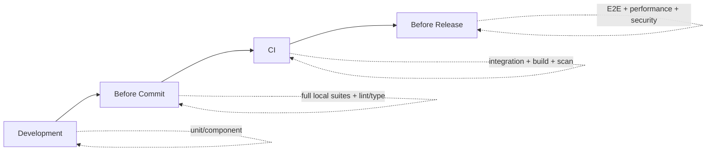

# DataDeck — Testing Strategy

> Defines what to test at each layer and when. Tool choices are only immutable
> where `PRD.md` specifies them; everything else is marked **Recommended** and
> may change. Coverage targets are **Recommended** unless stated otherwise.

---

## 1. Principles

1. Test behavior and contracts, not implementation details.
2. The API envelope and the credential boundary are contracts; they MUST be
   tested.
3. No test may depend on a developer's local database. Integration tests use
   disposable, reproducible targets.
4. Tests MUST NOT contain real credentials; use fixtures and environment
   variables.
5. Fast feedback during development; comprehensive checks in CI/release.

---

## 2. Backend Tests

Backend is Go; the idiomatic default is the stdlib `testing` package
(**Recommended**, since the PRD does not name a test framework).

### 2.1 Unit Tests

- **Target:** pure logic with no I/O — envelope construction, error mapping,
  validation, serialization rules (64-bit ints as strings, `NULL` handling),
  config parsing, truncation math.
- **Rules:** table-driven where practical; no network, no filesystem.
- **Must cover:** the 50 MB truncation decision and the 32-byte key validation.

### 2.2 Repository Tests

- **Target:** `internal/repository` against the embedded SQLite store.
- Use a temporary SQLite database per test (in-memory or temp file).
- **Must cover:**
  - CRUD for connection profiles, history, saved queries.
  - Foreign-key behavior: history `ON DELETE CASCADE`, saved queries
    `ON DELETE SET NULL`.
  - Idempotent schema creation/migration on startup.
  - That stored passwords are ciphertext, never plaintext.

### 2.3 Security Tests

- **Must cover:**
  - AES-256-GCM round-trip encrypt/decrypt.
  - Unique nonce per encryption (two encryptions of identical plaintext differ).
  - Tampering detection: modified ciphertext/tag fails authentication.
  - Key length validation rejects non-32-byte keys.
  - API responses never include password fields.
  - Log output never contains supplied credential values (capture and assert).
  - Error responses are sanitized (no stack traces / DSNs).

### 2.4 Database Integration Tests

- **Target:** `internal/database` against real target engines.
- PostgreSQL and MySQL are required by the development setup (PRD §8.1) and
  SHOULD run via Docker/container fixtures. SQLite can run in-process.
- **Must cover:**
  - Pool get-or-create and reuse; 5s health ping behavior.
  - Schema introspection output for each driver.
  - Query execution for `SELECT` and DML, `rows_affected`, duration measurement.
  - Type fidelity: BIGINT as string, NULL, JSON/JSONB, timestamps, binary/UUID.
- **Needs Validation:** SQLite as a target DB is only partially specified; test
  it if/when confirmed.

### 2.5 API Integration Tests

- **Target:** the Chi router and handlers via `httptest`.
- **Must cover:**
  - Envelope shape on success and error for every endpoint.
  - Status codes and error codes (validation, SQL, timeout, connection,
    internal).
  - CORS preflight and allowlist behavior.
  - Request body limit → `413`.
  - Timeout behavior with a deliberately slow query.
  - 50 MB truncation → `truncated: true`.
  - Panic recovery middleware → `INTERNAL_ERROR`.

---

## 3. Frontend Tests

Frontend is Next.js/React/TypeScript. Tooling is **Recommended** (PRD does not
name a test runner); a common default is a unit/component runner (e.g., Vitest +
React Testing Library) and Playwright for E2E.

### 3.1 Unit Tests

- **Target:** `lib/api-client.ts`, `lib/utils.ts`, hooks, store logic.
- **Must cover:**
  - Envelope parsing: success → typed data; error → typed error object.
  - BIGINT-as-string handling in the grid layer.
  - Zustand store transitions (tab dirty state, active connection).
  - Keybinding mapping (`Cmd+Enter`, `Cmd+S`).

### 3.2 Component Tests

- **Target:** `components/editor`, `components/grid`, `components/sidebar`,
  `components/shared`.
- **Must cover:**
  - SqlEditor renders and emits run/save events.
  - DataGrid virtualizes (does not mount all rows) and handles large result sets.
  - SchemaTree renders the nested hierarchy and context menu.
  - Error/empty/loading states render without crashing.

### 3.3 API Integration Tests

- **Target:** the frontend against a running (or mocked) backend.
- **Must cover:**
  - API client round-trips for each endpoint shape.
  - Error envelope surfaces as UI error, not an unhandled rejection.
  - TanStack Query caching/deduplication behavior.

---

## 4. System Tests

### 4.1 End-to-End Tests

- **Target:** real browser + real backend + disposable target database.
- **Must cover the PRD core flow:** create connection → test → activate → schema
  tree → run query (`Cmd+Enter`) → virtualized grid → save snippet → history.
- **Must cover failure flows:** bad credentials, unreachable host, SQL syntax
  error, timeout.

### 4.2 Production Build Validation

- **Must cover:**
  - `next build` with `output: 'export'` succeeds.
  - `CGO_ENABLED=0 go build -ldflags="-s -w"` succeeds and produces a binary.
  - Static export embeds via `embed.FS` and serves from the binary.
  - Docker images build and `docker-compose up` serves the app.
  - PWA manifest/icons present; app is installable.

### 4.3 Performance Tests

- **Must cover:**
  - Backend idle RAM `< 25 MB` (PRD §1.1 target).
  - Grid renders 100,000+ rows at ~60 FPS without DOM bloat (PRD §5).
  - 50 MB result truncation under memory pressure.
- **Should cover:** cold-start time and query latency regression thresholds.
- **Needs Validation:** no numeric thresholds are given beyond idle RAM and row
  count; define practical CI thresholds before enforcing in CI.

---

## 5. When to Run What

### During Development

- Backend unit + repository + security tests (fast, no external services).
- Frontend unit + component tests.
- Run the affected package only for quick feedback.

### Before Commit

- Full backend unit/repository/security suites.
- Frontend unit + component suites.
- Lint and type checks (`go vet`, TypeScript `tsc`).

### During CI

- Everything from "before commit".
- Backend API integration tests and database integration tests (with container
  services).
- Frontend API integration tests.
- Production build validation (both static-export/single-binary and Docker).
- Dependency/vulnerability scan.
- **Recommended:** E2E smoke on the main flow.

### Before Release

- Full E2E suite across supported browsers.
- Full production build + single-binary and Docker packaging checks.
- Performance tests against documented thresholds.
- Security pass: no secrets committed, credential redaction verified, CORS
  allowlist verified, loopback binding verified.

---

## 6. Test Data & Fixtures

- Use disposable target schemas seeded by migrations/fixtures, not production
  data.
- Fixture connections use environment-provided credentials; never hardcode.
- Integration tests MUST clean up created profiles/history.

## 7. Coverage & Quality Gates (Recommended)

- Line coverage targets are **Recommended**, not PRD-mandated. Suggested floors:
  - Security package: high (aim near-complete; this is a security-critical path).
  - Repository and API handler packages: substantial.
  - Pure UI components: pragmatic.
- No merge with failing tests, lint, or type checks.

---

## 8. Open Questions (Needs Validation)

1. Test frameworks/tooling (not fixed by PRD) — documented as recommendations.
2. Coverage thresholds.
3. Performance thresholds beyond idle RAM and 100k-row rendering.
4. Whether SQLite target DB is in scope for integration tests.
5. Browser/OS support matrix for E2E.
6. CI provider specifics beyond the `.github/workflows` layout implied by PRD §5.
